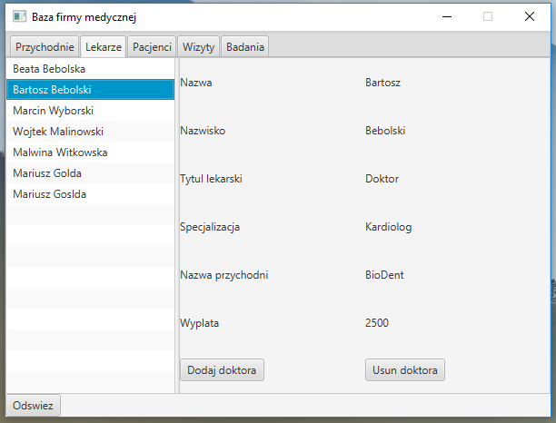
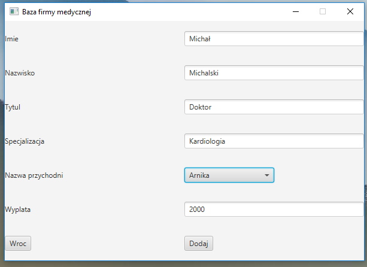
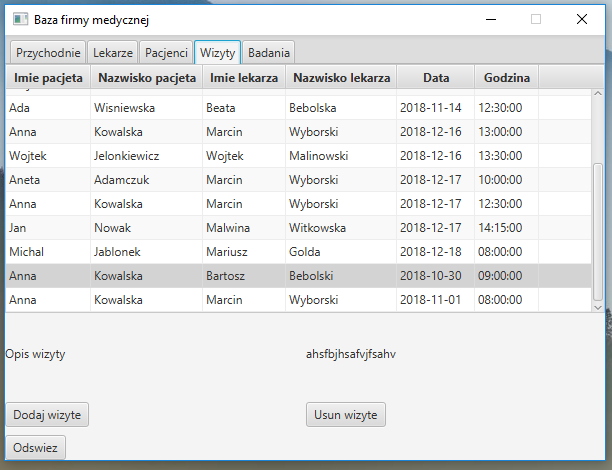
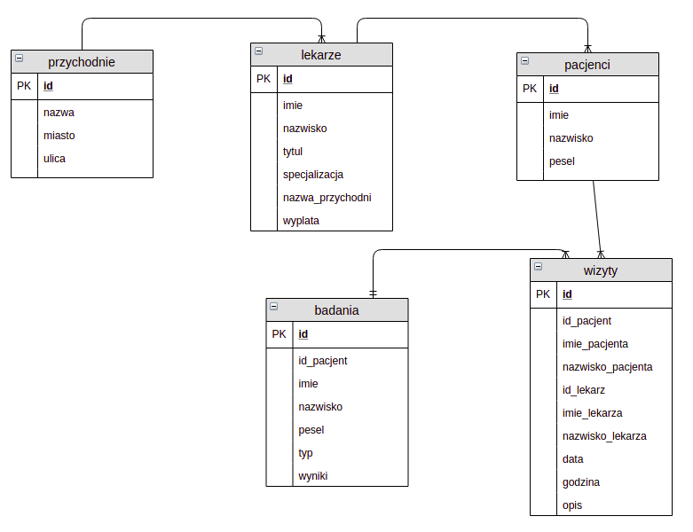
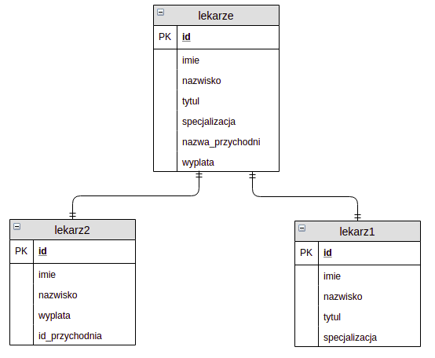
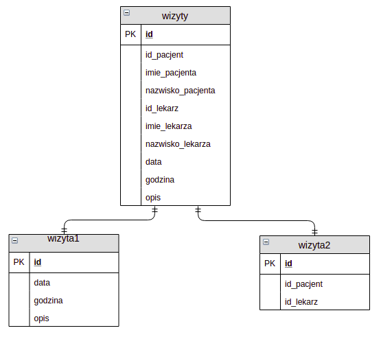
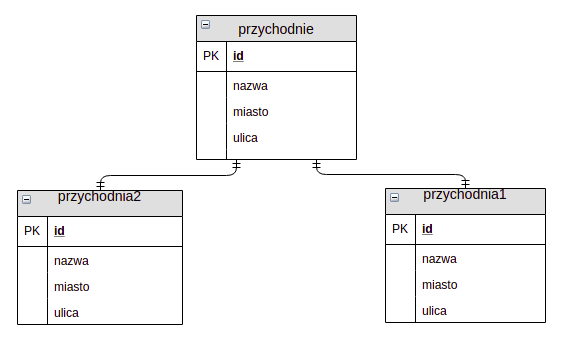

# Medical Clinic Desktop Mananger

## Abstract 
Medical Clinic Mananger is allication which helps to manage your clinics. 
You can work with a desktop user interface.
The biggest advantage of this system is the fact that it works with distributed databases and has a great synchronised mechanism which manages your data between databases. 
It allows you to keep data and has access to a database even if one instance is not available.
Some views are split horizontally or vertically 
It is very useful if you deal with very important data.

## Technologies
- Java
- JavaFX
- MsSQL Server

## Requirements
- 2 instance of MsSQL Server
- JRE

## Tutorial 
Desktop application was created in way to gives users the best experience. User doesn't know that the app works with a distributed database in the background. When the application starts it automatically logs into the database. Next you can see user interface like below. There are 5 tabs which are exactly the same as Views in the database. To check details about something press it. At the beginning o f your work you should create at least one clinic.

<p align="center"><p align="center"></p>

If you press Add doctor (Dodaj doktora) button it will open a manager which allows you to add a doctor. You should fill all fields. In addition you should choose a clinic (nazwa przychodni) from the list.

<p align="center"><p align="center"></p>

If you go to visits (Wizyty) tab you will see your visits.

<p align="center"><p align="center"></p>

In this app you can easily manage all data in the database. Next picture shows the manager adding new visit.

<p align="center"><p align="center"></p>

## Description
This system needs three machines with an OS system. 
One of them is the OS system where the user works. 
Rest of them are machines where databases will be located. 
User works with a desktop application which runs on his OS. 
How to configure and install applications I described below. 
You can also find a tutorial which helps you deal with applications in section Tutorial.
Next section describes how dbs works.

### Database 
There are shown views in the UML diagram which helps you understand db. Some views pull information from more than one table. Below the first diagram there is a description how doctors, visits and clinic tables are splitted. I explained it there. 

#### Description of views name
The names of views and columns are in Polish because it was one of the requirements.
Every view has its own ID. 
- On the top left corner you can see a clinic (przychodnie) view. It contains the name (nazwa), the city (miast) and street (ulica) of the clinic. 
- On the left of it there is a doctor's (lekarze) view. Every doctor has a name (imie), a surname (nazwisko), a graduate level (tytul), a specialisation (specjalizacja), a name of clinic (nazwa przychodni) and a payroll (wyplata). 
- On the right side you can find a patient's (pacjenci) view. Every patient has a name (imie), a surname (nazwisko) and a personal number (pesel). 
- View patients are connected with visits. This view has ID (id_patient), a name (imie_pacjenta) and a surname (nazwisko_pacjenta) of patient and ID (id_lekarz), a name (imie_lekarza) and a surname (nazwisko_lekarza) of doctor. It also contains the date (data), time (godzina) and description (opis) of the visit. 
- Last view presents the examinations (badania) and contains ID, name, surname, pesel, type (type), and results (wyniki) of examination. 

<p align="center"><p align="center"></p>

Some of the views are split vertically and some are horizontally. It means that some rows from view are kept only in one instance of the database and some are duplicated depending on needs. For instance the doctors' view are split vertically. 
- columns name (imie), surname (nazwisko) are duplicated,
- columns graduate level (tytul), specialisation (specjalizacjia) are kept on only first instance,
- columns name of clinic (nazwa przychodni) payroll (wyplata) are kept on the second db.

It means when the first instance will be destroyed users will have access to name (imie), surname (nazwisko), name of clinic (nazwa przychodni) and payroll (wyplata) of the doctor.

<p align="center"><p align="center"></p>

The visit tables are split horizontally so no data is duplicated.
- The date (data), time (godzina) and description (opis) are saved in one database
- and the ID (id_patient) and name (imie_pacjenta) are on the second database.

<p align="center"><p align="center"></p>

For clinics there was an implementing mechanism which allows to create records on only one instance. 
The mechanizm decides where to create a new row depending on algorytm. 
So some clinics are located on only one db instance so if one instance is destroyed half of clinics survive in the second db.

<p align="center"><p align="center"></p>

#### Rules
There are few rules which should be restricted in db to help keep databases organised.
- Every doctor has to be assigned to clinic
- You can add a clinic only if the name and localization of the clinic is unic.
- You can delete a clinic only if clinic doesn't have any doctor
- Every doctor and patience can be added if they have unic full name
- Every doctor has to be assigned to only one clinic
- If you delete a doctor or a patient all his future visits will be deleted.

## Installation
For installation this service you have to have two instances with MsSQL Service on two separate machines. Next you have to set static IP on each instance. This ip allows you to connect user applications to databases.

<em> Unfortunately currently the IP address and db username with password is fixed in the code so the instance where you plan to connect should have IP address "192.168.43.5" and db user should be with username "sa" password "Student1"! (Controller.java:57)</em>

In addition you should install Microsoft SQL Server Management Studio for me it was 17) which helps you to set up databases.
For my testing I have chosen two OS:

- Microsoft Server 2016
- Ubuntu Server 16.04

These systems were chosen because both of them support application MsSQL Service.

Then you have to download this repository and enter the SQL_procedures directory.
You will find there are five sql scripts. 
You should set the filename and the directory for the database and for logs.
Go to both 1_create_1_instance.sql and 1_create_1_instance.sql and change the localization paths in second procedure <<DB_PATH>>, <<DB_LOGS>>.
Paths should be adapted to the OS system where db works.
Next you have to run a script depending on the db instance.
First run script with number 1_create... then 2_connect... and in the end number 3_create_views_procedures.sql.
Make sure that you insert only procedures for the correct db instance.
Script 3_create_views_procedures.sql should be create an instance where you going to connect

Next you can enter the app directory and run java application Clinic.jar.
```
java Clinic.jar
```
You should see a desktop application in like in Tutorial.

